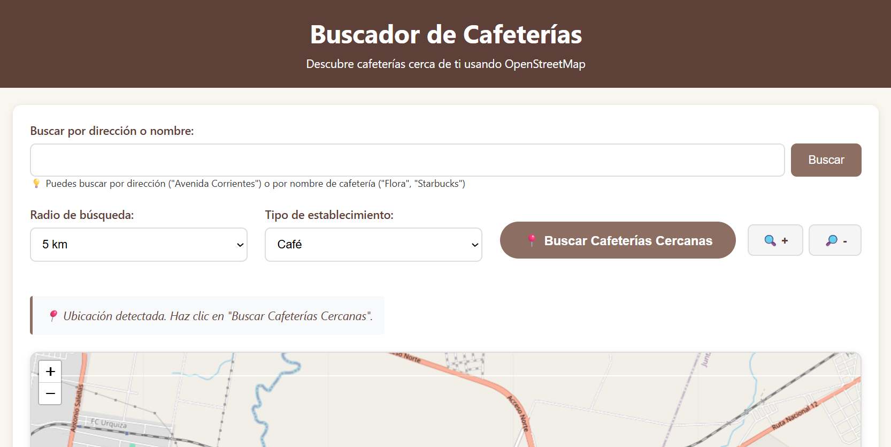
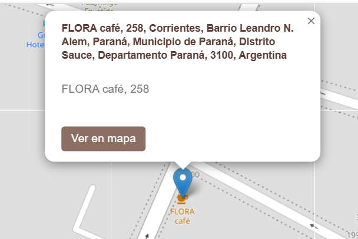
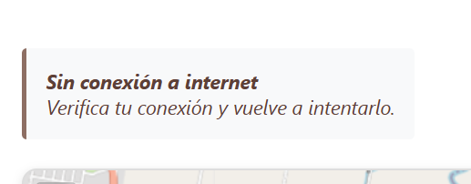
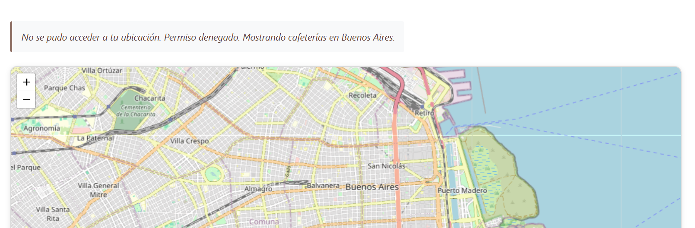

# Buscador de Cafeterías - Ruiz Abril

## Descripción

Un buscador interactivo de cafeterías cercanas utilizando OpenStreetMap y Leaflet.js. Permite encontrar cafeterías por ubicación actual, dirección específica o nombre de establecimiento.

## Tecnologías utilizadas

- Leaflet.js
- OpenStreetMap
- Nominatim API
- Leaflet.markercluster

## Instalación

1. Clona el repositorio:
   ```bash
   git clone https://github.com/usuario/cafe-finder.git
   cd cafe-finder
   ```
2. Abre el archivo `index.html` en tu navegador preferido (o utiliza un servidor local):

- **En Windows**: start index.html
- **En macOS**: open index.html

# Servidor local

- **Con Live Server (VS Code)**: Instala la extensión "Live Server" y haz clic derecho en index.html → "Open with Live Server"
- **Con Python**: python -m http.server 8000
- **Con Node.js (http-server)**: npx http-server

## Estructura del proyecto

```
cafe-finder/
├── index.html          # Página principal con la interfaz
├── style.css           # Estilos y diseño responsive
├── script.js           # Lógica de búsqueda y manejo del mapa
└── README.md           # Este archivo
```

## Funcionalidades

- Detección de ubicación actual y búsqueda de cafeterías cercanas
- Búsqueda por dirección y/o nombre específicos
- Filtros por radio (1km, 2.5km, 5km, 10km, o 20km) y por tipo de establecimiento (Coffee Shop, Café, o Todos)
- Visualización de información detallada en popups (nombre, dirección y enlace a OpenStreetMap)
- Controles manuales de zoom mediante botones "+" y "-"
- Diseño responsive adaptable a móvil, tablet y desktop

## Screenshots


_Página principal con búsqueda y filtros_


_Popup con datos del establecimiento_


_Validación de conexión y errores_


_Ubicación por defecto cuando no hay permisos de geolocalización_

## Autor

- Abril Ruiz
- abrilvalentinaruiz516@gmail.com
